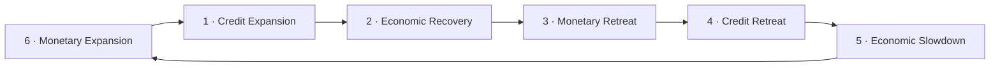
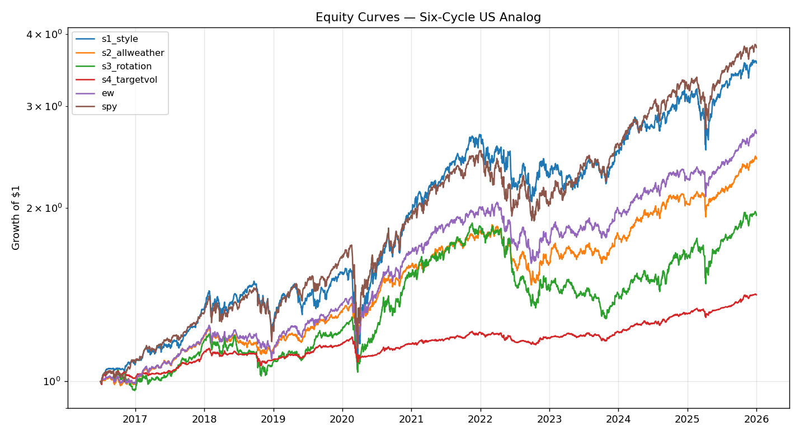
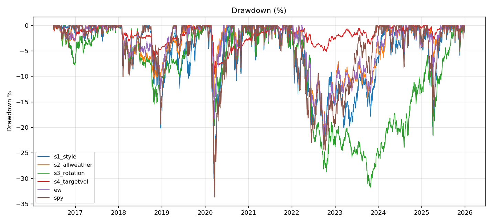
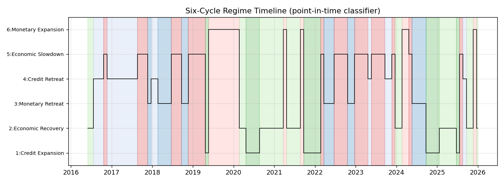
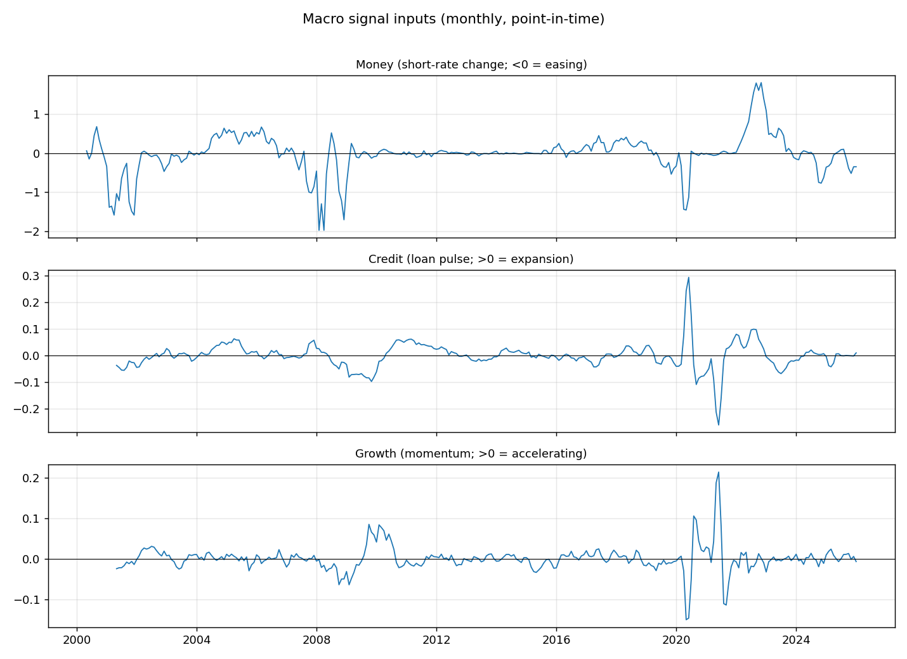
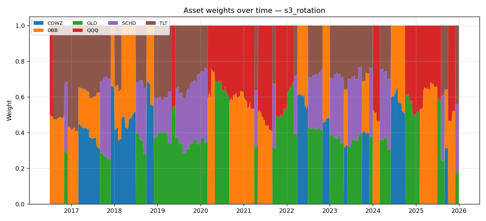

# Six-Cycle Multi-Asset ETF Rotation — US-Market Analog: Backtest Report
*Generated 2026-06-16 · backtest window 2016-06-01 → 2025-12-31 · rebalance Monthly · prices: Tiingo · macro: FRED · growth signal: INDPRO (Industrial Production)*
> **What this is.** A faithful-in-*structure* reproduction of the Guosheng Securities “Six-Cycle Framework” multi-asset ETF rotation paper, rebuilt on **US ETFs** with a **point-in-time** macro classifier from free FRED data. It is a transferability test — *does the idea travel to US markets?* — not an attempt to reproduce the literal China numbers.

> **Data provenance:** live fetch — prices: Tiingo, macro: FRED.

## Executive summary
### In plain terms
The economy moves through a repeating cycle of phases — money loosens, then credit expands, then growth picks up, and later the reverse. The source paper's idea is simple: **work out which of six phases the economy is in right now, then hold the assets that have historically done best in that phase**, and re-check every month. This report re-tests that idea on real **US ETFs** (stocks by style, gold, commodities, long-term Treasuries), using a **leak-free** classifier that only ever looks at macro data that was actually known at the time.

**The four strategies tested** (all on the same six-phase engine):
- **S1 Style Rotation** — rotate the *equity style* (Growth / Quality / Value) by phase.
- **S2 All-Weather** — hold *every* phase's basket at once, no timing (a control).
- **S3 Six-Cycle Rotation** — the *main* strategy: hold only the current phase's basket.
- **S4 Rotation + Target-Vol** — S3 dialled to a low, steady volatility target.

### The result in context
The paper reports an in-sample Sharpe near **2.0** for its main rotation strategy. A prior reproduction (AxiomQ) collapsed that to **0.48** — but through three *mechanical* failures (wrong substitute assets, a missing gold leg, and a hand-typed hindsight regime timeline), not a refutation of the method. This build fixes all three and asks where the honest, out-of-sample-style number lands — expected **below** the paper's flattered ~2.0 but **above** AxiomQ's 0.48.

**Headline results (this run):**
| Strategy | CAGR | AnnVol | Sharpe | MaxDD | Calmar | AnnTurnover | WinRate_vs_EW | WinRate_vs_SPY |
|---|---|---|---|---|---|---|---|---|
| S1 Style Rotation | 14.3% | 18.6% | 0.69 | -31.4% | 0.46 | 2.16 | 60.5% | 51.8% |
| S2 All-Weather | 9.8% | 9.6% | 0.78 | -21.4% | 0.46 | 0.65 | 40.4% | 40.4% |
| S3 Rotation | 7.2% | 13.0% | 0.43 | -31.8% | 0.23 | 3.57 | 41.2% | 42.1% |
| S4 Target-Vol | 3.7% | 3.9% | 0.36 | -9.6% | 0.39 | 1.59 | 39.5% | 35.1% |
| Equal-Weight (EW) Benchmark | 11.0% | 11.0% | 0.80 | -21.7% | 0.51 | 0.26 | 0.0% | 41.2% |
| SPY (Buy & Hold) | 15.1% | 18.1% | 0.74 | -33.7% | 0.45 | 0.10 | 58.8% | 0.0% |


### What's in this report
- **[Part I](#part-i--the-source-paper-six-cycle-framework)** — the source paper: the six-phase idea, its macro signals, and the four strategies.
- **[Part II](#part-ii--the-prior-reproduction-axiomq-and-why-it-underperformed)** — the prior attempt (AxiomQ) and the three mistakes that sank it.
- **[Part III](#part-iii--this-backtest-setup-purpose--choices)** — how this backtest is built: data, assets, *how a phase is decided from the macro data*, and mechanics.
- **[Part IV](#part-iv--results)** — results: equity curves, drawdowns, regime timeline, and metrics.
- **[Part V](#part-v--interpretation)** — interpretation: why the number lands where it does, plus honest caveats.
- **[Part VI](#part-vi--reproducibility)** — how to reproduce the run.

---

## Part I — The source paper (Six-Cycle Framework)
**Paper:** *Multi-Asset ETF Allocation under the Six-Cycle Framework* (六周期框架下的多资产ETF配置), Guosheng Securities Financial Engineering (Wang Yisheng, Liu Fubing), 2025-11-05.

**Core idea.** Locate where the economy sits on a six-stage macro cycle, then rotate a basket of style and multi-asset ETFs into whatever historically performs best in that stage. Within each stage, weight by risk parity; optionally scale leverage to a low volatility target.

### The macro classifier — three dimensions
| Dimension | Paper indicator | Signal logic |
|---|---|---|
| Money (货币) | DR007 short interbank rate | Falling rate = loose |
| Credit (信用) | New medium/long-term loans, TTM YoY (“loan pulse”) | 3-month change; rising = expansion |
| Growth (增长) | PMI (official + Caixin) | PMI momentum, up vs down |

### The six-stage clock
The stages cycle in a fixed order driven by the classic **monetary → credit → growth** lead-lag chain: money loosens first, then credit expands, then growth recovers; later money tightens, credit contracts, growth slows — and the clock loops.


- **Style adaptation:** stages 1–2 favour **Growth**; 3–4 favour **Quality**; 5–6 favour **Value**.
- **Asset classes:** offensive (stocks, commodities) lead stages 1–3; defensive (bonds) lead 4–6; transitional (gold) leads the growth-down stages 5, 6, 1.

### Stage → asset mapping (paper Figure 5)
| Stage | Paper holdings |
|---|---|
| 1 Credit Expansion | ChiNext (growth) + Gold |
| 2 Economic Recovery | ChiNext + Non-ferrous futures (commodity) |
| 3 Monetary Retreat | Cash-flow (quality) + Non-ferrous futures |
| 4 Credit Retreat | Cash-flow + 30Y Treasury + Non-ferrous futures |
| 5 Economic Slowdown | Dividend (value) + 30Y Treasury + Gold |
| 6 Monetary Expansion | Dividend + 30Y Treasury + Gold |

### The four strategies & reported in-sample results
| Strategy | Period | AnnReturn | AnnVol | MaxDD | Sharpe |
|---|---|---|---|---|---|
| S1 Style Rotation | since 2013 | 27.3% | 23.3% | 38.1% | 1.17 |
| S2 All-Weather | since 2014 | 11.5% | 6.9% | 11.2% | 1.66 |
| S3 Rotation (main) | since 2014 | 23.0% | 11.3% | 12.0% | 2.04 |
| S4 Target-Vol | since 2014 | 9.4% | 3.2% | 3.4% | 2.88 |


- **S1 Style Rotation** — switch the Growth/Quality/Value blend by stage.
- **S2 All-Weather** — hold all six stage-baskets at once, risk-parity, *no timing*.
- **S3 Six-Cycle Rotation** — the main strategy: hold only the current stage's basket.
- **S4 Rotation + Target-Vol** — S3 scaled to ~3% annualised vol; highest Sharpe.

> **Caveat (theirs).** All paper figures are **in-sample**: the cycle definitions, mappings and weights were fit on the same history that was then tested. 2015 (+56.5%) flatters the rotation average heavily.

---

## Part II — The prior reproduction (AxiomQ) and why it underperformed
AxiomQ attempted the China strategy but **lacked the required data**, so it ran a *proxy* reproduction over ~2,876 trading days (~11.4 yrs, 2014–2025): weekly rebalance, daily returns, annualisation 252, costs = 1bp commission + 2bp slippage.

**AxiomQ results:**
| Strategy | AnnReturn | Sharpe | MaxDD |
|---|---|---|---|
| Equal-Weight (EW) Benchmark | 6.09% | 0.42 | -42.74% |
| S1 All-Weather | 6.08% | 0.51 | -28.26% |
| S2 Rotation (net) | 5.77% | 0.48 | -29.53% |
| S3 Target-Vol | 1.64% | 0.52 | -10.97% |


### The three downgrades that crushed the Sharpe (≈2.0 → 0.48)
1. **Wrong ingredients (universe bias).** None of the 7 target ETFs were available. Substitutes were 4 broad indices + a dividend basket + a non-ferrous *stocks* basket. Worst of all, an **equity index (SSE50) stood in for the 30Y Treasury** — the wrong asset class entirely, which destroys the defensive ballast the rotation relies on in stages 4–6.
2. **No gold.** No gold series existed locally, so the **gold leg was set to 0**. The defensive/transitional cushion (stages 1, 5, 6) simply vanished — likely the single biggest Sharpe killer.
3. **Hand-typed regime timeline.** With no rate/loan/PMI inputs, the classifier was replaced by a **hard-coded 14-segment monthly timeline**. This is both illegitimate (hindsight, not reproducible) and crude (mis-timed transitions).

**Bottom line:** the gap was *mechanical*, not evidence against the framework. The state machine, risk parity and target-vol layers all ran fine; the result was dominated by missing assets and a fake classifier. **Those are exactly the three things this build fixes.**

---

## Part III — This backtest: setup, purpose & choices
### Purpose
Test whether the Six-Cycle *idea* transfers to US markets, with an honest, point-in-time classifier and the real asset classes the paper intended (including gold and a true long bond). We expect a Sharpe **below** the paper's in-sample ~2.0 but **above** AxiomQ's 0.48 — that middle ground is the real result.

### The three fixes vs AxiomQ
| AxiomQ failure | This build |
|---|---|
| Wrong substitute assets / equity-as-bond | Real US ETFs for every leg, incl. a true long bond (**TLT**) |
| Gold leg zeroed | **GLD** held in stages 1, 5, 6 as intended |
| Hand-typed hindsight timeline | **Live, point-in-time** classifier from FRED with publication lags |

### Data stack
- **ETF prices → Tiingo** (adjusted close; survivorship-aware free EOD). Stooq available as a free cross-check.
- **Macro → FRED**. Point-in-time via ALFRED vintages when a key is present; otherwise the latest-revision series with a fixed publication lag of **21 days** applied so the classifier never peeks.
- **Growth signal → INDPRO (Industrial Production)** (PMI is proprietary and not freely bulk-downloadable; we use a free FRED proxy — this materially affects the growth leg and is a documented choice).

### Asset / equity choices (US analog)
| Leg | Paper instrument | US ETF used | Role |
|---|---|---|---|
| Growth | ChiNext | **QQQ** | Offensive equity, stages 1–2 |
| Quality | Free-cash-flow | **COWZ** | Mid-cycle quality, stages 3–4 |
| Value | Dividend low-vol | **SCHD** | Defensive equity, stages 5–6 |
| Gold | Gold ETF | **GLD** | Transitional cushion, stages 1/5/6 |
| Commodity | Non-ferrous futures | **DBB** | Cyclical, stages 2–4 |
| 30Y Bond | 30Y Treasury | **TLT** | Defensive ballast, stages 4–6 |
| Benchmark | CSI 800 | **SPY** | Broad-market reference |

### How a phase is decided from the macro data
Every month-end, the raw macro series are turned into a single phase label through a fixed six-step pipeline. Nothing is hand-set — the label falls out of the data:

1. **Collect the raw monthly series from FRED** (resampled to month-end): the 3-month T-bill rate `DGS3MO`, commercial & industrial loans `BUSLOANS`, the high-yield credit spread `BAMLH0A0HYM2` (a tie-breaker), and industrial production `INDPRO` (or `CFNAI`).
2. **Turn each into a momentum metric** — we care about *direction of change*, not level:
   - **Money** = −(3-month change in the T-bill rate). A *falling* rate means policy is loosening.
   - **Credit** = the “loan pulse” = the 3-month change in `BUSLOANS` year-over-year growth. *Accelerating* lending means credit is expanding.
   - **Growth** = the 3-month change in `INDPRO` YoY growth (i.e. acceleration), or a 3-month average of `CFNAI`. *Speeding up* means growth is improving.
3. **Reduce each metric to a +1 / −1 vote** with a **deadband + hysteresis**: clearly above zero → **+1**, clearly below → **−1**, but inside a small dead zone the metric is treated as noise and the *previous* vote is held (this stops the label flickering on tiny wiggles). For Credit, a too-small loan pulse is broken by the high-yield spread — a *falling* spread votes expansion (+1).
4. **Map the three votes → one of six phases.** The triple `(Money, Credit, Growth)` has eight possible sign combinations; the 8→6 table below assigns each to a phase, following the classic **money → credit → growth lead-lag chain** (policy turns first, lending follows, real growth last). Six combinations are the canonical clock; the remaining two (where credit lags) fold into the nearest phase. *The paper omits this table, so it is our documented assumption.*
5. **(Optional) clock smoothing:** when enabled, the phase may only advance to the same or the next clockwise phase, never jump — a further whipsaw guard.
6. **Make it leak-free (point-in-time):** each month-end label is only made available **21 days later** (the publication lag) and then carried forward onto trading days — so the phase used on any given day relies only on data that was actually published by then.

*Worked example.* Suppose in a given month the T-bill rate is falling (**Money = +1**), loan growth is accelerating (**Credit = +1**), but industrial production is still contracting (**Growth = −1**). The triple `(+1, +1, −1)` maps to **Phase 1 — Credit Expansion**, so that month holds the Phase-1 basket. The live path of these votes and the resulting phases over the whole test window is plotted in [Part IV](#part-iv--results) (*Macro signal inputs* and *Regime timeline*).

### The classifier — signals & the 8→6 mapping (DOCUMENTED ASSUMPTION)
In precise terms, each dimension is reduced to +1/−1 with a small deadband + hysteresis to suppress whipsaw:
- **Money** = sign of the *fall* in the 3-month T-bill (`DGS3MO`) over 3 months (falling = loose).
- **Credit** = sign of the 3-month change in `BUSLOANS` YoY growth (loan pulse); ties broken by the direction of the HY OAS (`BAMLH0A0HYM2`, falling spread = expansion).
- **Growth** = sign of the 3-month change in `INDPRO` YoY (acceleration), or the sign of a 3-month CFNAI average.

The paper does **not** publish the table that maps the eight (money, credit, growth) sign combinations to the six stages. We construct one from the monetary→credit→growth lead-lag chain and **flag it as our assumption, not paper-sourced**:

| Money | Credit | Growth | → Stage |
|:---:|:---:|:---:|---|
| + | − | − | 6 Monetary Expansion |
| + | + | − | 1 Credit Expansion |
| + | + | + | 2 Economic Recovery |
| − | + | + | 3 Monetary Retreat |
| − | − | + | 4 Credit Retreat |
| − | − | − | 5 Economic Slowdown |
| + | − | + | 2 Economic Recovery *(credit = laggard)* |
| − | + | − | 5 Economic Slowdown *(credit = laggard)* |

### Stage → basket (US ETFs used here)
| Stage | Basket (legs → ETFs) |
|---|---|
| 1 Credit Expansion | growth=QQQ, gold=GLD |
| 2 Economic Recovery | growth=QQQ, commodity=DBB |
| 3 Monetary Retreat | quality=COWZ, commodity=DBB |
| 4 Credit Retreat | quality=COWZ, bond=TLT, commodity=DBB |
| 5 Economic Slowdown | value=SCHD, bond=TLT, gold=GLD |
| 6 Monetary Expansion | value=SCHD, bond=TLT, gold=GLD |

### Backtest mechanics
- **Rebalance:** Monthly (last trading day of each period), effective the **next** trading day (1-day execution lag → leakage-free).
- **Within-stage weighting:** inverse-volatility risk parity over a 60-day lookback; legs with too little history are excluded and the rest renormalised (never zero-filled).
- **Target-vol (S4):** leverage = clip(3% / trailing annualised vol, 0, 3); residual cash earns the 3-month T-bill rate.
- **Costs:** 1bp commission + 2bp slippage, no stamp duty. **Annualisation:** 252.
- **Start date:** 2016-06-01 — real-instrument data, no synthetic splice

---

## Part IV — Results
### Equity curves


### Drawdowns


### Regime timeline (what the live classifier saw)


### Macro signal inputs


### Rotation weights over time (S3)


### Metrics (this run)
| Strategy | CAGR | AnnVol | Sharpe | MaxDD | Calmar | AnnTurnover | WinRate_vs_EW | WinRate_vs_SPY |
|---|---|---|---|---|---|---|---|---|
| S1 Style Rotation | 14.3% | 18.6% | 0.69 | -31.4% | 0.46 | 2.16 | 60.5% | 51.8% |
| S2 All-Weather | 9.8% | 9.6% | 0.78 | -21.4% | 0.46 | 0.65 | 40.4% | 40.4% |
| S3 Rotation | 7.2% | 13.0% | 0.43 | -31.8% | 0.23 | 3.57 | 41.2% | 42.1% |
| S4 Target-Vol | 3.7% | 3.9% | 0.36 | -9.6% | 0.39 | 1.59 | 39.5% | 35.1% |
| Equal-Weight (EW) Benchmark | 11.0% | 11.0% | 0.80 | -21.7% | 0.51 | 0.26 | 0.0% | 41.2% |
| SPY (Buy & Hold) | 15.1% | 18.1% | 0.74 | -33.7% | 0.45 | 0.10 | 58.8% | 0.0% |


*Regime mix over the test window:* S1 13%, S2 21%, S3 14%, S4 16%, S5 24%, S6 12%.

---

## Part V — Interpretation
**The honest middle ground.** Set the three columns side by side:

| | Paper S3 (in-sample) | **This build** | AxiomQ S2 (proxy) |
|---|---|---|---|
| Main rotation Sharpe | ~2.04 | **0.43** | 0.48 |

Why below the paper: (1) the paper's figures are **in-sample** and flattered by 2015; (2) the US growth signal is a **proxy** (INDPRO/CFNAI), not the PMI the paper uses; (3) our 8→6 mapping is an assumption, not a re-fit; (4) a different central bank and universe.

Why above AxiomQ: the **real assets are present** — gold cushions the growth-down stages and a true long bond (TLT) provides the defensive ballast — and the **classifier is point-in-time**, not a hindsight timeline.

### Honest caveats
- **In-sample vs out-of-sample.** We do not re-fit the mapping; still, the stage definitions come from the paper's framework, so this is a *structural transfer test*, not a clean OOS experiment.
- **Growth-proxy sensitivity.** Swapping INDPRO↔CFNAI shifts the growth leg and therefore the stage path and results.
- **Splice / start-date distortion.** Quality (COWZ) is a recent ETF; extending before its inception requires a proxy splice (logged above) or clamping the start date.
- **Free-data fidelity.** Tiingo/Stooq adjusted EOD is good but not institutional survivorship-grade; `BUSLOANS` is an imperfect analog of China's medium/long-term loan pulse.

---

## Part VI — Reproducibility
```bash
pip install -r requirements.txt
export TIINGO_API_KEY=...   # free at tiingo.com
export FRED_API_KEY=...     # free at fred.stlouisfed.org
sixcycle fetch-data --start 2016-06-01 --end 2025-12-31
sixcycle run --strategies s1,s2,s3,s4,ew,spy --out-dir outputs/run1
sixcycle report --run-dir outputs/run1 --out REPORT.md
# no keys? runs offline on bundled CSV data:
sixcycle run --source csv --macro-source csv --out-dir outputs/demo
```

Full resolved parameters for this run are in `run_config.json`.

---

*Generated by the `sixcycle` backtester. All figures are model output on the data described above; see the caveats in Part V before drawing conclusions.*
