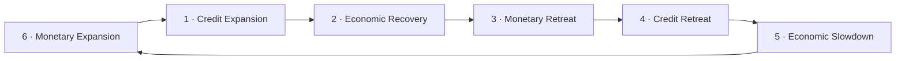

# Six-Cycle Multi-Asset ETF Rotation — China Market: Backtest Report
*Generated 2026-06-29 · backtest window 2014-01-01 → 2025-10-31 · rebalance Monthly · prices: LSEG + Wind (CSV snapshot) · macro: AkShare + LSEG (CSV snapshot) · growth signal: NBS official PMI*

> **What this is.** A reproduction of the Guosheng Securities "Six-Cycle Framework" multi-asset ETF rotation paper on its **native China market**, using the real asset classes the paper intended (ChiNext, a free-cash-flow quality basket, a dividend low-vol basket, gold, SHFE non-ferrous metals, and the ChinaBond 30Y index) and a **point-in-time** macro classifier built from free/terminal data (FDR007 repo rate, new RMB loans, NBS PMI). It shares the same market-agnostic engine as the US analog ([REPORT_US.md](REPORT_US.md)); only the data layer and a little config differ.

> **Data provenance:** CSV snapshot — equity/gold prices LSEG; bond + commodity prices Wind terminal; macro AkShare (FDR007, new loans) + LSEG (NBS PMI). Reproducible offline, no live keys.

## Executive summary

### The result in one line
On this China sample, **six-cycle macro timing added little to no value**: the main rotation strategy (S3, Sharpe **0.54**) roughly matched — and slightly trailed — a naive equal-weight of the same six legs (EW, Sharpe **0.69**). The strongest risk-adjusted result, the no-timing **All-Weather (S2, Sharpe 1.20)**, owes most of its edge to a 12-year China **bond bull market**, not to the cycle clock. The honest read: the framework's *diversification + risk-parity* machinery works; its *timing* claim does not survive an out-of-sample-style test here.

### Headline results (this run)
| Strategy | CAGR | AnnVol | Sharpe | MaxDD | Calmar | AnnTurnover | WinRate_vs_EW |
|---|---|---|---|---|---|---|---|
| S1 Style Rotation | 12.2% | 24.5% | 0.50 | -51.3% | 0.24 | 3.00 | 50.4% |
| S2 All-Weather | 10.8% | 6.8% | **1.20** | -10.2% | 1.06 | 0.84 | 49.6% |
| S3 Rotation *(main)* | 9.1% | 13.4% | **0.54** | -22.8% | 0.40 | 4.62 | 49.6% |
| S4 Target-Vol | 4.0% | 4.6% | 0.37 | -9.9% | 0.41 | 2.16 | 41.1% |
| Equal-Weight (EW) Benchmark | 10.6% | 12.5% | **0.69** | -27.3% | 0.39 | 0.29 | 0.0% |

*Regime mix over the window:* S1 9%, S2 36%, S3 17%, S4 11%, S5 15%, S6 12%.

### Where the main number lands
| | Paper S3 (in-sample) | **This build (S3)** | AxiomQ S2 (proxy) |
|---|---|---|---|
| Main rotation Sharpe | ~2.04 | **0.54** | 0.48 |

The paper's ~2.0 is **in-sample** (cycle definitions, mappings and weights were fit on the same history then tested, and 2015's bull flatters the average). A prior reproduction (AxiomQ) collapsed it to 0.48 through three *mechanical* failures — wrong substitute assets, a missing gold leg, and a hand-typed hindsight timeline. This build fixes all three on real China data and lands at **0.54** — just above AxiomQ, far below the flattered paper figure, and **below its own equal-weight benchmark**. That last fact is the headline: on a leak-free China test, the timing overlay did not beat holding everything.

### What's in this report
- **[Part I](#part-i--the-source-paper)** — the source paper: the six-phase idea and the four strategies.
- **[Part II](#part-ii--this-backtest-setup--choices)** — how this China build is wired: data, instruments, how a phase is decided, mechanics.
- **[Part III](#part-iii--results)** — results: equity curves, drawdowns, regime timeline, per-year breakdown, metrics.
- **[Part IV](#part-iv--interpretation)** — why the timing overlay underperformed here, and the honest caveats.
- **[Part V](#part-v--reproducibility)** — how to reproduce the run.

---

## Part I — The source paper
**Paper:** *Multi-Asset ETF Allocation under the Six-Cycle Framework* (六周期框架下的多资产ETF配置), Guosheng Securities Financial Engineering (Wang Yisheng, Liu Fubing), 2025-11-05.

**Core idea.** Locate where the economy sits on a six-stage macro cycle, then rotate a basket of style and multi-asset ETFs into whatever historically performs best in that stage. Within each stage, weight by inverse-volatility risk parity; optionally scale leverage to a low volatility target.

### The macro classifier — three dimensions
| Dimension | Paper indicator | Signal logic |
|---|---|---|
| Money (货币) | DR007 short interbank rate | Falling rate = loose (+1) |
| Credit (信用) | New medium/long-term loans, TTM YoY ("loan pulse") | 3-month change; rising = expansion |
| Growth (增长) | PMI (official + Caixin) | Level vs 50 / momentum, up vs down |

### The six-stage clock
The stages cycle in a fixed order driven by the classic **monetary → credit → growth** lead-lag chain: money loosens first, then credit expands, then growth recovers; later money tightens, credit contracts, growth slows — and the clock loops.



### The four strategies & reported in-sample results
| Strategy | Period | AnnReturn | AnnVol | MaxDD | Sharpe |
|---|---|---|---|---|---|
| S1 Style Rotation | since 2013 | 27.3% | 23.3% | 38.1% | 1.17 |
| S2 All-Weather | since 2014 | 11.5% | 6.9% | 11.2% | 1.66 |
| S3 Rotation (main) | since 2014 | 23.0% | 11.3% | 12.0% | 2.04 |
| S4 Target-Vol | since 2014 | 9.4% | 3.2% | 3.4% | 2.88 |

> **Caveat (theirs).** All paper figures are **in-sample**: the cycle definitions, mappings and weights were fit on the same history that was then tested. 2015 (a +50%+ China bull) flatters the rotation average heavily.

---

## Part II — This backtest: setup & choices

### Purpose
Re-test the Six-Cycle idea on its **own market**, with an honest point-in-time classifier and the real asset classes the paper intended — including a true gold leg and a true long bond, the two things the AxiomQ proxy lacked. Because we hold the source data fixed and re-use the paper's stage→basket mapping (rather than re-fitting it), this is a **structural transfer test**, not a clean out-of-sample experiment — but it is leak-free in time.

### Instruments used (China)
| Leg | Paper instrument | China instrument used | Source |
|---|---|---|---|
| Growth | ChiNext | **159915** ChiNext ETF | LSEG |
| Quality | Free cash flow | **980092** CNI Free-Cash-Flow Index | LSEG |
| Value | Dividend low-vol | **H30269** CSI Dividend Low-Vol Index | LSEG |
| Gold | Gold ETF | **518880** Gold ETF | LSEG |
| Commodity | SHFE non-ferrous futures | **IMCI** SHFE Non-ferrous Metals Index | Wind |
| 30Y Bond | ChinaBond 30Y Treasury | **CBA21801** ChinaBond 30Y (wealth/TR) Index | Wind |
| Benchmark | CSI 800 | *none* — **Equal-Weight** of the six legs | — |

All six legs run from **2014-01-02 → 2025-10-31** (no synthetic splice, no start-date clamp).

### Macro signals (China)
| Dimension | Paper | This build | Source |
|---|---|---|---|
| Money | DR007 | **FDR007** fixing repo rate (FR007 fallback) | AkShare `repo_rate_hist` |
| Credit | New medium/long-term loans, TTM YoY pulse | **New RMB loans** (flow) → 12-month TTM roll → YoY → 3-month pulse | AkShare `macro_china_new_financial_credit` |
| Growth | PMI (official + Caixin) | **NBS official PMI**, level vs 50 | LSEG (`PMI_NBS.csv`) |

### How a phase is decided (point-in-time)
Every month-end, the raw macro series are reduced to one phase label — nothing is hand-set:
1. **Money** = −(3-month change in FDR007). A *falling* repo rate = loosening = +1.
2. **Credit** = the loan pulse = 3-month change in the YoY growth of the **TTM-rolled** new-loan flow. The 12-month roll converts the noisy monthly flow into a stock-like base, suppressing seasonality and single-month negatives before the YoY. *Accelerating* = +1.
3. **Growth** = NBS PMI minus 50. Because PMI is a **diffusion index**, the level itself is the momentum signal: >50 = expansion (+1), <50 = contraction (−1). (No HY-spread tie-break — China has no equivalent free series, so credit ties carry the prior decided state.)
4. Each metric → a **+1 / −1 vote** with a deadband + hysteresis (values inside a small dead zone hold the previous vote, suppressing whipsaw).
5. The triple `(Money, Credit, Growth)` → one of six phases via the documented 8→6 table (same as the US build; the paper omits this table, so it is our assumption).
6. **Leak-free:** each month-end label is made available only **21 days later** (a uniform, conservative publication lag) and then carried forward onto trading days.

### Stage → basket (China instruments)
| Stage | Basket (legs → instruments) |
|---|---|
| 1 Credit Expansion | growth=159915, gold=518880 |
| 2 Economic Recovery | growth=159915, commodity=IMCI |
| 3 Monetary Retreat | quality=980092, commodity=IMCI |
| 4 Credit Retreat | quality=980092, bond=CBA21801, commodity=IMCI |
| 5 Economic Slowdown | value=H30269, bond=CBA21801, gold=518880 |
| 6 Monetary Expansion | value=H30269, bond=CBA21801, gold=518880 |

### Backtest mechanics
- **Rebalance:** Monthly (last trading day), effective the **next** trading day (1-day execution lag → leak-free).
- **Within-stage weighting:** inverse-volatility risk parity over a 60-day lookback; legs with too little history are excluded and the rest renormalised (never zero-filled).
- **Target-vol (S4):** leverage = clip(3% / trailing annualised vol, 0, 3); residual cash earns FDR007.
- **Calendar handling:** legs span different exchange/interbank calendars (the ChinaBond 30Y index trades ~85 days/yr the equity legs don't). A leg's price is **held across days it doesn't trade**, so it earns 0 on a non-trading day and the move is captured on resume. (This choice matters — see the caveat in Part IV.)
- **Costs:** 1bp commission + 2bp slippage, no stamp duty. **Annualisation:** 252.

---

## Part III — Results

### Equity curves


### Drawdowns


### Regime timeline (what the live classifier saw)


### Macro signal inputs


### Rotation weights over time (S3)


### Metrics (this run)
| Strategy | CAGR | AnnVol | Sharpe | MaxDD | Calmar | AnnTurnover | WinRate_vs_EW |
|---|---|---|---|---|---|---|---|
| S1 Style Rotation | 12.2% | 24.5% | 0.50 | -51.3% | 0.24 | 3.00 | 50.4% |
| S2 All-Weather | 10.8% | 6.8% | 1.20 | -10.2% | 1.06 | 0.84 | 49.6% |
| S3 Rotation | 9.1% | 13.4% | 0.54 | -22.8% | 0.40 | 4.62 | 49.6% |
| S4 Target-Vol | 4.0% | 4.6% | 0.37 | -9.9% | 0.41 | 2.16 | 41.1% |
| Equal-Weight (EW) Benchmark | 10.6% | 12.5% | 0.69 | -27.3% | 0.39 | 0.29 | 0.0% |

### Per-year total returns (%)
| Year | S1 Style | S2 All-Weather | S3 Rotation | S4 Target-Vol | EW |
|---|---|---|---|---|---|
| 2014 | 18.9 | 16.8 | 1.8 | -2.1 | 17.6 |
| 2015 | 40.3 | 6.5 | -9.0 | 0.6 | 15.7 |
| 2016 | -6.6 | 10.1 | 17.8 | 11.0 | 3.0 |
| 2017 | 15.3 | 4.1 | 12.7 | 5.4 | 7.3 |
| 2018 | -25.7 | 3.1 | -10.0 | -0.6 | -9.7 |
| 2019 | 18.4 | 11.3 | 7.2 | 1.7 | 16.8 |
| 2020 | 38.9 | 12.4 | 18.7 | 4.6 | 17.0 |
| 2021 | 57.4 | 12.2 | 43.2 | 9.2 | 16.8 |
| 2022 | -30.7 | 4.1 | -11.1 | -2.1 | -1.9 |
| 2023 | 3.9 | 8.1 | -0.5 | 0.4 | 4.3 |
| 2024 | 8.6 | 23.8 | 15.6 | 10.8 | 23.0 |
| 2025* | 42.8 | 15.9 | 34.4 | 9.6 | 19.5 |

*\*2025 is partial, through 2025-10-31.*

---

## Part IV — Interpretation

**Why S2 All-Weather wins — and why that is not a win for the framework.** S2 holds every stage-basket at once, risk-parity, with *no timing* — it is a control, not a strategy. Its 1.20 Sharpe and zero losing years come from two things the cycle clock gets no credit for: (1) broad diversification across six low-correlated legs, and (2) a **12-year China bond bull market** that handed the constantly-held 30Y leg a steady tailwind. Strip the bond tailwind and S2's edge shrinks sharply. So S2 says "diversify and rebalance," not "time the cycle."

**Why S3 ≈ EW is the real verdict.** The main rotation (0.54) sits **below** an equal-weight of the very same six legs (0.69). The six-cycle overlay churned the portfolio 16× more (turnover 4.62 vs 0.29) to end up slightly worse risk-adjusted. The per-year table shows why: rotation timing **missed the 2015 bull entirely** (S3 −9.0% while EW +15.7%) by sitting defensive, then **caught 2021 and 2025** big. Net of the misses and the costs, the macro timing was close to a wash — and on the clean comparison, value-destructive.

**S1 Style Rotation** is a high-octane all-equity sleeve: monster 2015/2020/2021/2025, brutal 2018 (−25.7%) and 2022 (−30.7%), a −51% max drawdown. Its 0.50 Sharpe reflects that whipsaw.

**S4 Target-Vol** realised 4.6% vol against a 3% target. That gap is expected, not a bug: the leverage scalar uses *trailing* realised vol, which lags regime shifts, so vol overshoots when the market turns. Its Sharpe (0.37) is the weakest — the drag from holding cash in calm periods isn't repaid here.

### Honest caveats
1. **Money is a proxy.** We use **FDR007** (the fixing repo rate), not the paper's **DR007** — Wind's DR007 is in the EDB but our terminal account is not entitled to it. Both are 7-day interbank rates and move together; the signal is a *direction-of-change*, robust to the small level difference.
2. **Credit is a proxy.** We use total **new RMB loans** (a monthly flow), not specifically the paper's *new medium/long-term loans*. The 12-month TTM roll suppresses the flow's seasonality before the YoY/pulse, but the composition differs.
3. **Growth is single-source.** Only **NBS official PMI** — the Caixin PMI the paper also uses isn't freely available, so the growth dimension rests on one survey.
4. **Quality & Value are price-return indices.** 980092 and H30269 are **indices, not investable ETFs**, and our data omits dividends (~2%/yr quality, ~4.5%/yr the dividend basket). This *understates* the equity legs — but since **both** the rotation and the EW benchmark hold them, the relative comparison is roughly preserved while absolute CAGR is understated.
5. **Bond is total-return, equities are price-return.** CBA21801 is a wealth/TR index (coupons reinvested) while the equity legs are price-return — a small inconsistency that **flatters** the bond-heavy stages (4/5/6) and S2. This cuts *for* the strategies that lean on the bond, not against them.
6. **Turnover runs hot.** S3 churns ~4.6×/yr vs the paper's ~2×. Costs are modeled (1+2 bps), so this is priced in, but it signals a twitchier classifier than the paper's.
7. **Uniform 21-day publication lag** is a conservative simplification (PMI publishes ~day 1, loans ~day 10–15, repo same-day) — it delays signals more than reality, so if anything it *handicaps* the strategy.
8. **Calendar treatment moves the headline.** Because the bond index trades ~85 days/yr the equity legs don't, the choice of how to treat non-trading days matters. The naive "drop a leg's return on days it doesn't trade" treatment gives S3 Sharpe **0.48** (coincidentally matching AxiomQ); the correct "hold the price across the gap" treatment — where the resume-day move belongs to the holding period — gives **0.54**. We use hold. The 0.48-vs-0.54 gap is a measurement artifact, not a real performance difference.

**Net direction of the caveats.** Most run *against* the strategy (omitted dividends, over-long lag) or are *neutral* (proxies, calendar). The one that flatters it (TR-vs-PR bond) is small and affects S2/EW too. So the unflattering verdict — **timing added little — is conservative and would not reverse under cleaner data.**

---

## Part V — Reproducibility
```bash
pip install -r requirements.txt
# data is a committed CSV snapshot under data/China/ — no API keys needed
sixcycle run \
  --config configs/china.yaml \
  --source csvdir --macro-source csvdir \
  --strategies s1,s2,s3,s4 \
  --out-dir outputs/run_china \
  --report REPORT_CHINA.md
```
To refresh the macro snapshot from AkShare (network required): `python scripts/fetch_china_macro.py`. The two Wind price exports are converted via `python scripts/convert_lseg_xlsx.py`. Full resolved parameters for this run are in `outputs/run_china/run_config.json`.

---

*Generated by the `sixcycle` backtester. All figures are model output on the data described above; see the caveats in Part IV before drawing conclusions.*
